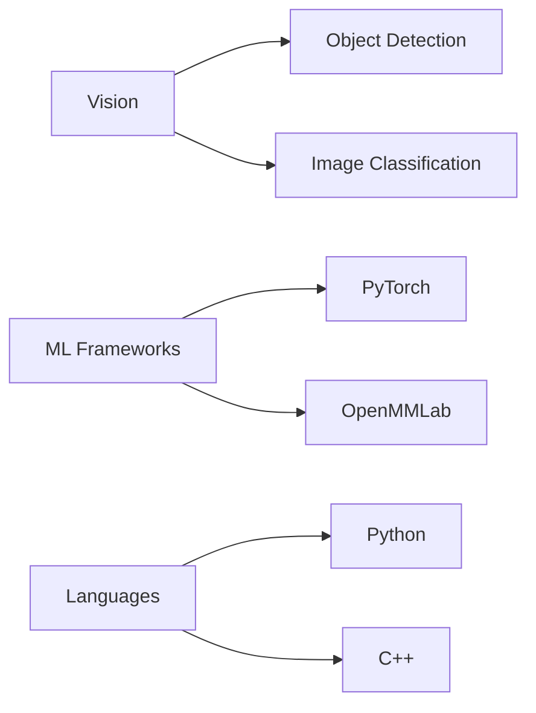

# 💻 Flulike owns this space!

🎓 Master's Student in Computer Vision @ Tokyo  
🌐 Communication Engineering Background | 💻 Full-Stack Algorithm Enthusiast  
🔭 Currently hacking: `Computer Vision` `Deep Learning` `Image Processing`

👨 Rookie of github and software engineer. 

---

### 🛠️ Tech Stack & Preferences

)

---

🌐 **Profile**  
*Aspiring Computer Vision Engineer | Tokyo xxx Student*

---

### 🌱 Featured Projects

#### 🚗 VDC-YOLO - CCTV Vehicle Detection System
**Tech Stack:** Python • MMyolo • PyTorch  
**Features:** 
- Self-attention + Convolution hybrid architecture
- Real-time object detection (30+ FPS)
- Advanced occlusion handling

**Achievements:**

✅ 6.2% mAP improvement over YOLOv8 baseline  
✅ Optimized for CCTV angle challenges  
✅ Featured in MMYOLO 

---

### 📚 Academic Journey

#### 🎓 **Tokyo xxx** (2024-Present)  
*MSc Information and Computer Technology*  
`Research Focus:`  
- Object Detection Optimization  
- Multi-modal Classification

#### 🎓 **Southwest xxx University** (2017-2021)  
*BEng Communication Engineering*  
`Thesis Work:`  
- Signal Processing Algorithms  
- Wireless Communication Systems

---

### 📬 Contact Channels

**Let's Connect:**  
  
  
  
 *Notion acess needs my permission*   

---

### 🛠️ Technical Arsenal

---
### 👷 Professional Journey

#### 🏦 **Technical Product Manager**  
`Multinational Bank (Chongqing) | 2021 - 2022`  
 

**Key Contributions**  
- 📊 Coordinated cross-departmental requirements from 5+ business units  
- 🤝 Managed 3 external vendors for core banking system modernization  
- 🚀 Spearheaded mobile app feature rollout 
**Tools**: `Jira` `Confluence` `SWIFT/BIC` `Visio`

---

#### 🔌 **Hardware Design Engineer**  
`IoT Solutions Provider (Chongqing) | 2020 (6-month Internship)`  
 

**Technical Achievements**  
- ⚡ Optimized sensor power architecture for 35% longer battery life  
- 📡 Designed dual-mode communication circuits (Modbus/CAN) with 99.7% signal integrity  
- 🛠️ Completed full hardware lifecycle from schematic to mass production  
**Stack**: `Altium Designer` `STM32` `Oscilloscope Debugging` `EMC Testing`

---

#### 🌐 **Backend Developer**  
`E-commerce Platform (Remote) | 2020 (Summer Internship)`  
 

**Performance Highlights**  
- ⚡ Reduced API latency by 62% via Redis caching strategies  
- 🔐 Implemented RBAC system blocking 1.2k+ potential security incidents monthly  
- 📊 Built real-time analytics dashboard supporting 500k+ daily transactions  
**Tech**: `Spring Boot` `MySQL Cluster` `ELK Stack` `Jenkins`

---
### 🎮 Terminal Interface

**whoami**  
**Flulike** - CV Researcher | Python Evangelist  

**neofetch**  
- **OS**: Ubuntu 20.04 LTS x86_64 -> updating!!! & Windows 11
- **CUDA**: 11.8 -> updating!!!
- **GPU**: A6000 × 4 & RTX 4090  
- **Shell**: zsh 5.8  
- **Editor**: VSCode & Cursor  
- **Theme**: Dracula  

**coffee --status**  
Kidding, I'm not a coffee guy. I prefer pure water in my life.    

**hobbies --show-all**  

- ⚽ **Football Mode Activated**:  
  - 🏆 **Club**: REAL MADRID (Following since Raul)  
  - 🇯🇵 **High School**: All Japan High School Soccer Tournament (Winter Tradition)  
  - 🎌 **Local Support**: Any high school football team in Tokyo or Chiba!!!  

- 🎵 **Music is all I need**:  
  - 🎹 **Instruments**: Have learned the piano since I was 4  
  - 🎹 **Band**: Keyboard of UU band in Southwest xxx  
  - 🎻 **Hobby**: Orchestra (Berliner Philharmoniker)  
  - 🎷 **Hobby**: Brass Band (Japan high school)  

- 🎮 **Game Library**:  
  - 🔫 **FPS**: CS2 (2k hrs) | Valorant (Diamond Rank)  
  - ⚔️ **MOBA**: Dota 2 (Carry Main, MMR 5800)  
  - 🗡️ **JRPG**: Persona Series | Final Fantasy | Xenoblade Chronicles  

- 💗 **Anime**:  
  - 1️⃣ **Sound! Euphonium**  
  - ❤️‍🔥 **BangDream**  
  - 💝 **Shōjo Kageki Revyū Sutāraito**  
---
### 🗓️ Daily Routine
**schedule --daily --tz=GMT+9**

| Time    | Activity          | Details                               |
|---------|--------------------|---------------------------------------|
| **09:00** | 🧪 **[Lab]**      | Progress: ███████████████████░░░░░ 75% |
| **13:00** | 🏋️ **Gym Session** | Focus: ▮▮▮▮▮ (2hr Powerlifting)        |
| **15:00** | 🖥️ **[Lab]**      | Progress: ████████████████████████░ 90% |
| **19:00** | 🍜 **Dinner Break**| Menu: 🍣🍚🥢 (Fried Chicken)             |
| **21:00** | 🚇 **Return Home** | Activity: Listening to ASMR            |
---

  

---
